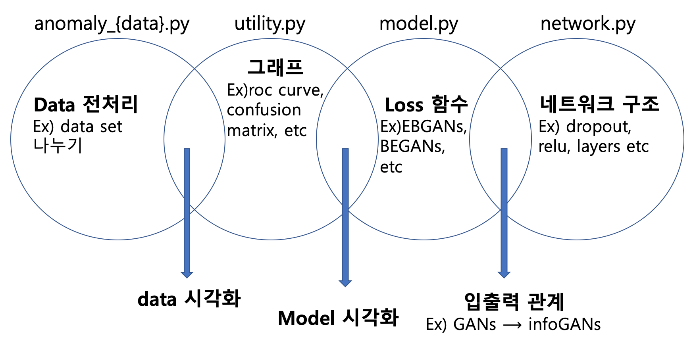

# Fault Detection Project for MNIST code


- 작성 날짜 : 2019.9.9
- 프로젝트 기간 : 2018.9 ~ 2018.12
- 개발환경 :
  - Ubuntu 16.04.5 LTS
  - python 3.5.2
  - tensorflow 1.6.0
  - TATAN X (Pascal) 12GB
- 소개
  - 본 문서는 저의 개발 역량을 보여주는 것이 목적입니다. 따라서 이 코드는 제가 직접 작성한 것입니다.   
  - 본 코드의 네트워크 기본 구조는 [anoGANs](https://arxiv.org/pdf/1703.05921) 이용하며, loss 함수와 각각의 네트워크의 구조는 실제 논문 구조에서 수정하였습니다.
  - 네트워크의 목적은 정상으로 정의된 데이터만으로 학습을 한 후, socre 함수를 정의하고 이를 이용하여 정상데이터와 비정상데이터를 구분하는 것이 목적입니다.
  - 실제 데이터에 적용하기 전 toy data에 적용된 모델입니다.


- python code 모듈 구조
```
{directory}
    |-- anomaly_{data}.py : 데이터 전처리 작업
    |-- model.py : 전체 네트워크 정의
    |-- network.py : 개별 네트워크 정의
    |-- utility.py : 그래프 그리기 및 저장 기능 등
test{number}.py : main 실행문
```

- python code 모듈 간 관계
 
  - 각 모듈 간의 관계는 위의 벤 다이어그램과 같습니다. 서로 교집합이 있는 곳의 기능이 수정이 된다면, 두 모듈이 수정되야 됨을 의미합니다. 예를들면 utility.py과 model.py의 교집합에 포함된 기능은 설계한 모델의 시각화 관련 함수입니다. 이 함수는 지도학습 또는 비지도학습과 같이 모델마다 달라지는 기능입니다. 또한 model.py은 anomaly_{data}.py와 교집합되는 곳이 없습니다. 이 의미는 anomaly_{data}.py가 수정되도 model.py에 영향을 끼치지 못한다는 것을 의미합니다.


- 구현 중 어려웠던 점
  - 가독성이 높은 코드 작성하기 위하여 코드 구조를 어떤식으로 구해야되는 지에대해서 어려움이 있었습니다. 이를 해결하기 위한 방법은 먼저 dirty code로 먼저 작성하고([link](https://github.com/kangheeyong/2018-1-Deep-Learing-pc1/tree/master/2018-2/for_19411)), 필수 기능들이 구현되면 정리하는 방식을 반복하는 방식으로 했습니다. 그 결과 위의 벤 다이어그램과 같은 결과가 나왔습니다.
