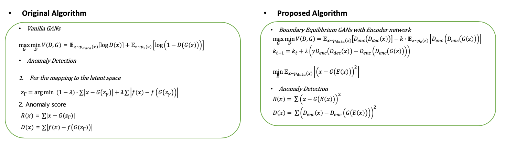
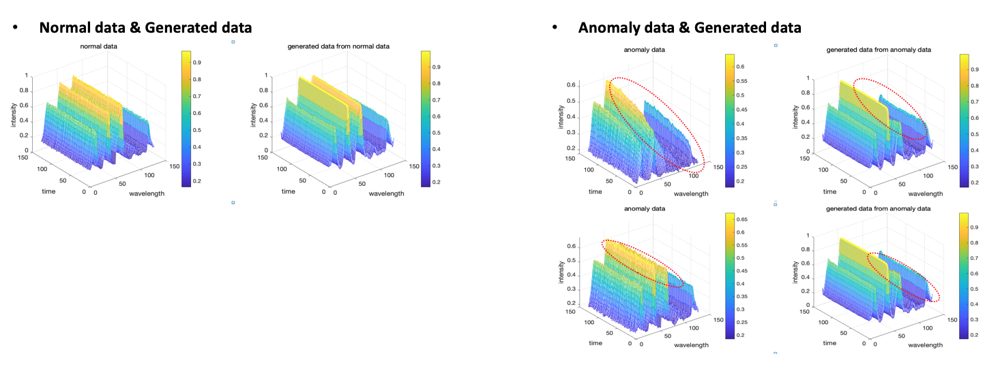
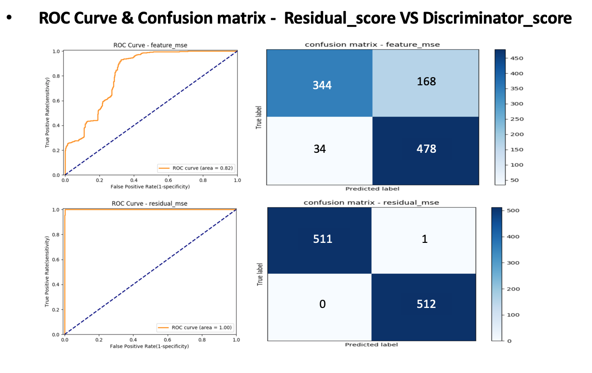

# anoGANs for PECVD Fault Detect using OES data

- 작성 날짜 : 2019.9.11
- 프로젝트 기간 : 2018.9 ~ 2018.12

- 소개
본 연구는 [anoGANs](https://arxiv.org/pdf/1703.05921)을 응용하여, 반도체 공정과정에서 얻게 되는 OES(Optical Emission Spectroscopy) 데이터를 가지고 이상패턴을 검출하는 알고리즘에 관한 연구입니다. 이 알고리즘의 가장 큰 특징은 정상데이터 만을 가지고 학습을 하는 것입니다. 그리고 테스트 단계에서는 정상데이터와 비정상데이터를 구분하기 위한 score를 정의한 뒤 그 score를 가지고 정상과 비정상 데이터를 구분합니다.

- 알고리즘 수식

- 실험 결과

| |Precision|Recall|F1 score|AUC|
|------|---|---|---|---|
|Discriminator score|0.9101|0.6719|0.7731|0.82|
|Residual score|1.0|0.998|0.999|1.0|

- 결론  
  - We propose anomaly detection based on Boundary Equilibrium GANs with Encoder Network.
  - We enable the identification of anomalies on unseen data based on unsupervised training of seen data.
  - Residual score was used to detect anomalous data, which enabled fault detection through the OES sensor in PECVD equipment.
  - This allows sensors to be used to determine the state of the equipment and to provide rapid diagnostics for large volumes of data. If used in the semiconductor industry, it will help reduce costs by reducing the time and manpower needed for diagnostics.

- 관련자료
  - [Fault Detection Project for MNIST code](https://github.com/kangheeyong/2018-1-Deep-Learing-pc1/blob/master/2018-2/experiment_anoGANs_2/ReadMe.md)

- 관련논문
  1. [Low Temperature Silicon Nitride and Silicon Dioxide Film Processing by Inductively Copeld Plasma Chemical Vapor Deposition](http://jes.ecsdl.org/content/147/4/1481.abstract)
  2. [Optical Emission Spectroscopy of the SiH4-NH3-H2 Plasma during the Growth of Silicon Nitride](http://iopscience.iop.org/1347-4065/20/2/L117)
  3. [Low temperature growth of silicon nitride by electron cyclotron resonance plasma enhanced chemical vapour deposition](https://www.sciencedirect.com/science/article/pii/S004060900001628X)
  4. [Unsupervised anomaly detection with generative adversarial networks to guide marker discovery](https://arxiv.org/pdf/1703.05921)
  5. [BEGAN: Boundary Equilibrium Generative Adversarial Networks](https://arxiv.org/abs/1703.10717)
