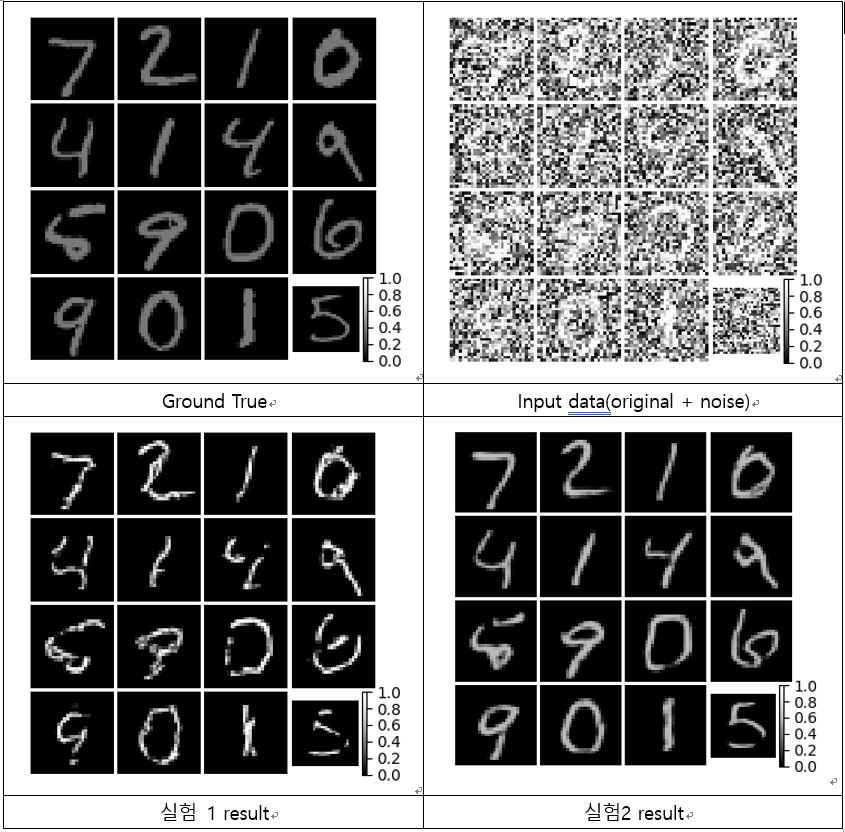
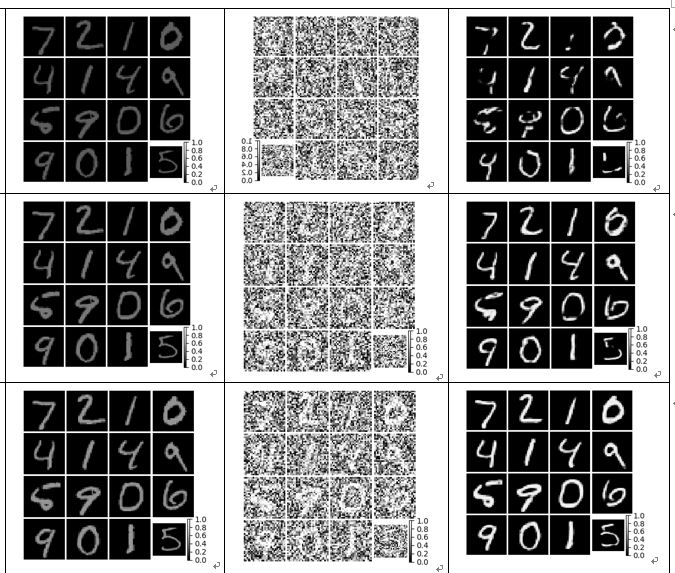
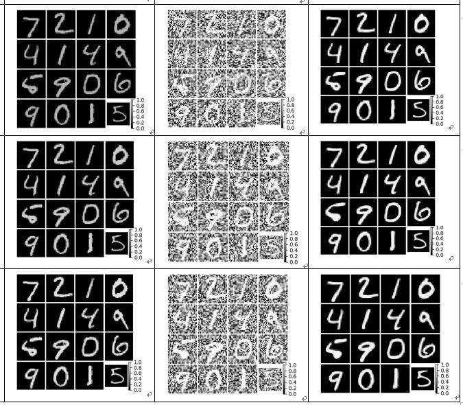

# experiment_1
#
2017년 당시 프로젝트의 결과가 안좋은 이유는 모델을 단순하게 설계함에 따라서 학습 데이터의 패턴도 단순 했다. 딥러닝 알고리즘은 보통 학습 데이터와 비슷한 패턴의 데이터가 입력으로 왔을 경우 성능이 좋게 나온다. 따라서 다양한 패턴의 데이터로 학습을 하면 실제 환경에서 더 좋은 성능을 낼 것이다.

* 가정 : 딥러닝 알고리즘은 보통 학습 데이터와 비슷한 패턴의 데이터가 입력으로 왔을 경우에만 성능이 좋게 나온다.

Noise Canceling Network 프로젝트의 첫번째 실험은 위의 가정이 맞는지 확인하는 것이다. 물론 일반적인 알고리즘이 저 가정을 따르는 것을 보이는 것은 어렵지만, 이 프로젝트와 가장 비슷한 구조의 네트워크를 설계한 네트워크로 먼저 실험을 해서 맞는지 확인할 것이다.

* 현제 문제 접근 방법
  1. 어떤 케이스의 문제를 발견함.
  2. 문제에 대한 해결책의 심증은 있지만, 확증은 없다.
  3. 여기서 제안사항은 실제 케이스에 적용 후 확인해보는데 비용이 많이 든다.
  4. 따라서 실제 케이스와 유사하지만 비용이 적게 드는 케이스를 만들어서 확인해본다.
  5. 결과를 보면 두가지가 나올것이다.
      * 유사한 케이스에서 해결이 됬다면 실제 케이스에서 해결이 될 확률이 올라간다는 결론을 얻는다.
      * 유사한 케이스에서 해결이 안됬었다면 실제 케이스에서도 해결이 안 될 확률이 올라간다는 결론을 얻거나, 처음부터 모델 설계를 잘못하여 엉뚱한 결론을 얻게 된다.    

위의 방법의 단점은 문제 해결방법이 맞았다면 시간과 비용이 더 소모되는게 단점이지만, 만약 그렇지 않다면 시간과 비용을 줄일 수 있게 되는 장점이 된다.

### 1. 실험 네트워크 모델 설계
과거의 프로젝트에서는 Fully Conneted layer로 네트워크를 구성 했지만, 이번에는 Convolutional layer와 skip connection으로 이루어진 네트워크로 구성할 계획이다. 실제 적용해야하는 것은 음성 데이터지만 이지미가 눈으로 확인하는게 편함으로 MNIST데이터를 사용한다.

> * 실험 1
learning :  a -> net -> a
test : 0.1*a -> net -> (0.1\*a 이외의 값 기대)

> * 실험 2
learning : r \* a -> net -> r \* a
여기서 r은 0.0~1.0까지의 임의의 수
test : 0.1\*a -> net -> (0.1\*a 가 나올것으로 기대)

실험1과 실험2의 가장 큰 차이점은 학습을 할 때, 입력값의 scale의 변화를 주냐 안주냐의 차이이다. 만약 결과 값이 위의 기대한 값으로 나온다면 내가 생각한 해결책이 맞을 가능 성이 높아진다고 생각해도 괜찮을 것이다.

  

위의 결과를 보면 예상한데로 나왔다고 할 수 있다. 위의 실험을 스케일의 관점에서 분석해보면 실험1은 1대1 대응 네트워크 이고, 실험2는 n대n 대응 네트워크라고 생각 할 수 있겠다. 그렇다면 1대n 대응과 n대1응을 생각해 볼 수 있는데, 1대n은 위의 구조로는 절대 만들 수 없을 거라고 생각한다.(만약 잠재변수가 있으면 가능할 것 같다.)

다음 실험은 n대1이 되는지 확인하는 실험을 할것이고, 어쩌면 Noise Canceling Net가 가져야 하는 특성은 ref 노이즈가 제거된 후에 STT에 넣을려면 어느정도 증폭된 신호가 필요할 것이다. 따라서 어떤 음량이든 간에 출력값은 어느정도 일반화된 값이 나오게 하는 특성을 가지면 좋을것 같다.  

> * 실험 3
learning : r \* a -> net ->  a
여기서 r은 0.0~1.0까지의 임의의 수
test : 0.1\*a -> net -> (a 가 나올것으로 기대)

  
  

위의 표는 가장 왼쪽이 입력데이터에 쓸 이미지이고 가운데는 입력데이터에서 노이즈를 투가한 다음 네트워크 입력으로 했다. 오른쪽은 결과 값이다. 입력이미지의 스케일은 원본의 0.3, 0.4, 0.5, 0.6, 0.7, 0.8로 했고 출력값은 원본의 0.9배로 했다. 자세한 실험 방법은 코드를 보연 알 수 있다. 위의 결과를 보면 어느정도 스케일이 달라도 출력값의 스케일은 일정하게 만들수는 있는걸로 보인다.

* 결론
    적어도 Convolutional Net에서는 처음에 가정한데로 학습한 데이터에 한에서는 좋게 나오지만 그 이외의 것은 기대하지 않는다고 생각하면 될것 같다. 결국 실제 환경에 쓰일 네트워크를 설계하려면 실제 환경에 맞춰서 학습데이터를 전처리 하는것이 최선일 것이라는 결론을 내렸다. 비록 여기서 사용한 MNIST 데이터의 실험만으로 단정짓는것은 성급할 수가 있으나, 여기서 결정을 안하면 이 실험은 영원히 끝이 안날것 같다. 다음 실험은 MNIST 데이터를 가지고 여러가지 네트워크 구조를 적용해봐야 겠다.
