# experiment_2
#
이 실험은 실제 음성데이터 학습에 쓰일 적절할 모델을 찾기 위해서 하는 실험이다. 음성데이터로 바로 하지 않은 이유는 전에 프로젝트를 했을때 한번 학습이 끝나는데 1주일정도 걸렸다. 따라서 적절한 모델를 찾는거 뿐이라면 비슷한 환경에서 작은 데이터로 실험을 빨리 끝내서 하는게 더 빠르고 효율적일거라고 생각했다. 이 실험에 쓰일 데이터는 MNIST data를 이용 했다. 요즘에 많이 안쓰이는 MNIST data를 선택한 이유는 지금 내가 가장 편하게 쓸수있는 데이터이고 이미지라서 결과물을 단순히 MSE(Mean Square Error)와 같은 수치로 보는게 아니라 실제 이미지를 보고 판단하는게 더 정확할 거라고 생각했기 때문이다. 구조를 찾기 위해서 [SRGANs](https://arxiv.org/abs/1609.04802)과 [SEGANs](https://arxiv.org/abs/1703.09452) 논문을 참고해서 실험했다. SRGANs의 경우 저화질 이미지를 고화질 이미지로 바꾸는 네트워크를 설계한 것이고, SEGANs은 음성 데이터에 있는 잡음을 제거하는 네트워크를 설계한 것이다. 이 두 네트워크의 공통점은 두가지이다. skip connect와 GANs 구조를 사용 했다. skip connect는 현재 보편적으로 쓰이고 있어서 크게 의문을 품지 않았다. 하지만 두 논문에서의 결론은 GANs 구조를 사용해서 정확도를 올렸다고 한다. 따라서 이번 실험은 GANs을 사용한 것과 사용하지 않은것이 성능이 얼마나 좋아졌는지 확인하는 것을 목적으로 하겠다.

### 1. network 구조

 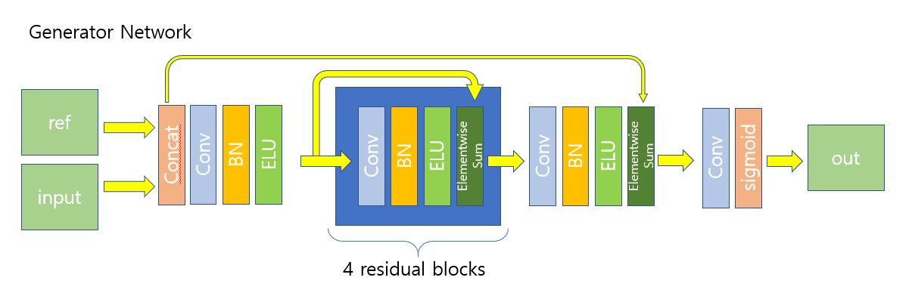

필터 역할을 하는 네트워크 구조를 [SRGANs](https://arxiv.org/abs/1609.04802)의 Generator Network를 참고 했다. loss function은  content loss와 Adversarial loss의 합으로 구성되는데 Adversarial loss는 기존 GANs의 generator network loss 함수이고, content loss는 기존 GANs에는 없는 함수인데 그냥 일반 Conv Net을 학습할 때 쓰는 loss 함수라고 생각하면 된다. 여기서 content loss 함수는 L1 loss 함수를 사용했다. 보통은 마지막 출력값을 tanh를 사용 했지만 여기서는 sigmoid를 사용했는데 그 이유는 딱히 없다.

 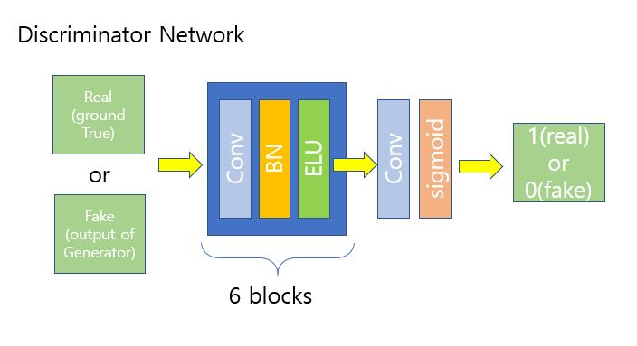

 vanilla GANs의 Discriminator Network 구조는 [SRGANs](https://arxiv.org/abs/1609.04802) Discriminator Network 구조를 참고 했다.

 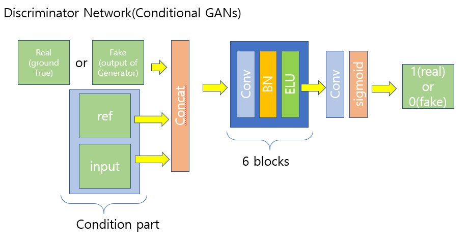

 [Conditional GANs](https://arxiv.org/abs/1411.1784)과 [SEGANs](https://arxiv.org/abs/1703.09452)를 참고해서 Discriminator Network 구조를 만들었다.

### 2. data augmentation 구조

 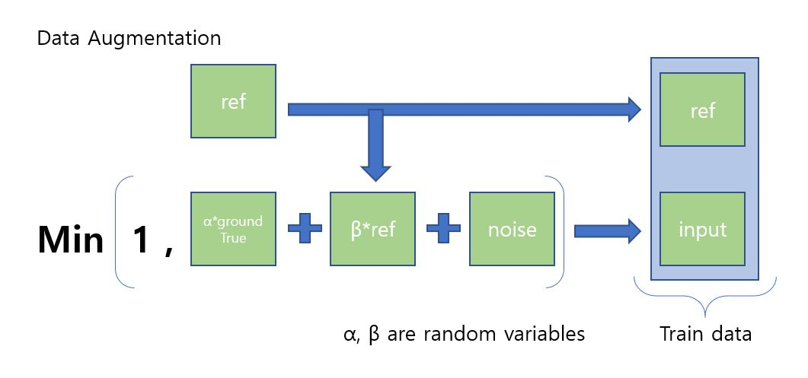

ref 데이터가 주어졌을 때, input data 안에 있는 ref 데이터와 노이즈를 제거하는 네트워크를 만들려고 한다. 그래서 위와 같이 설계 했다. 원래 설계하려는 것은 필터 역할을 해야하기 때문에 어떤 scale에도 동작하게 하기 위해서 학습할 때, 임의 변수를 곱하여 학습을 했다.  

### 3. 실험
#### 3.1 resConvNet_v1_dcnn 결과

 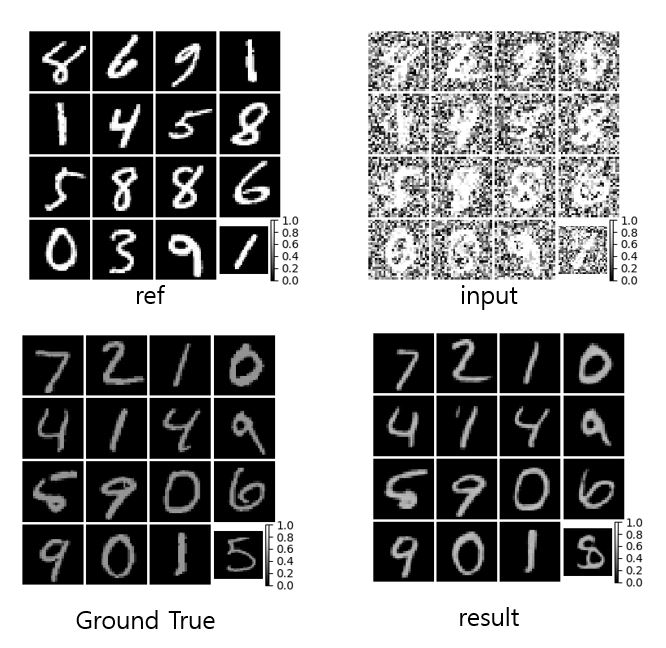

#### 3.2 resConvNet_v2_dcnn 결과

 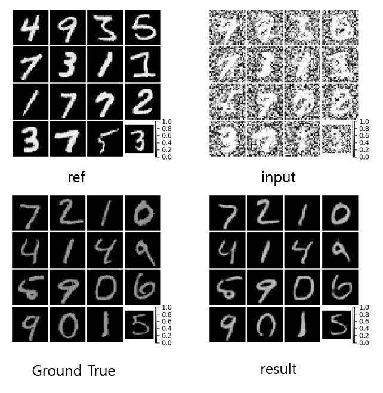

#### 3.3 resConvNet_v3_dcnn 결과

 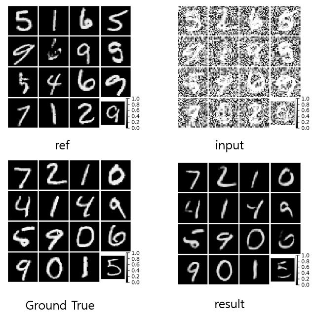

위의 실험의 차이점은 아래와 같다.

>resConvNet_v1_dcnn : a\*ground_true = net(a\*ground_true + b\*ref +noise, ref)
resConvNet_v2_dcnn : a\*ground_true = net(a\*ground_true + b\*ref +noise, b\*ref)
resConvNet_v3_dcnn : ground_true = net(a\*ground_true + b\*ref +noise, b\*ref)

resConvNet_v1_dcnn과 resConvNet_v2_dcnn의 차이점은 ref data의 scale이 일정하냐 일정하지 않느냐의  차이다. resConvNet_v2_dcnn과 resConvNet_v3_dcnn의 차이점은 출력되는 값의 scale이 일정하냐 일정하지 않느냐의 차이다. 결과를 보면 resConvNet_v3_dcnn 실험 결과는 생각보다 좋지 않았다. 아마도 문제는 학습이 부족하거나 네트워크 크기를 더 키워야 되나 싶다.

#### 3.4 resConvNet_v5_dcnn 결과

 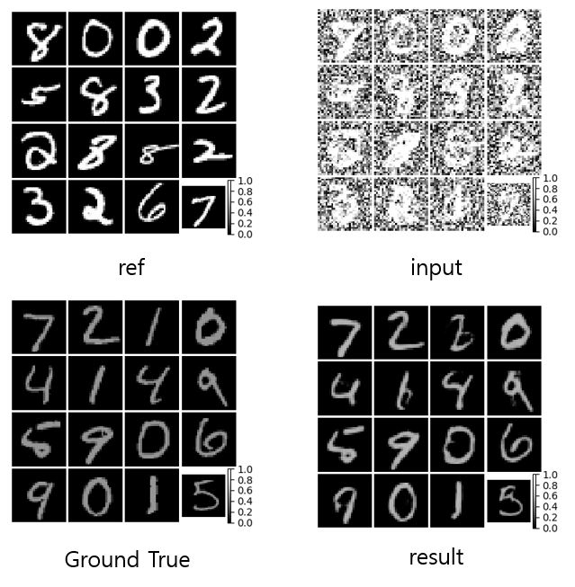

resConvNet_v5_dcnn 실험과 앞서한 실험의 차이점은 아래와 같다.

> resConvNet_v1_dcnn : a\*ground_true = net(a\*ground_true + b\*ref +noise, ref), 학습데이터 60,000
resConvNet_v5_dcnn : a\*ground_true = net(a\*ground_true + b\*ref +noise, ref), 학습데이터 1,000

즉, 학습에 사용한 데이터의 수가 다르다. 이 실험을 한 이유는 인터넷 동영상을 보다가 한국에서 개발한 이미지를 확대하는 알고리즘이 미국 어느 대회에서 우승했다고 하는것을 봤었다. 거기서 학습에 사용한 이미지 데이터가 약 400개라고 했었다. 그 알고리즘도 일종의 필터 알고리즘이라고 생각해서 지금 하고 있는 실험에 적용해 봤다. 결과는 전부다 사용하는것 보다 좋지는 않았지만 이 정도면 생각보다 나쁘지?않은것 같다. 어차피 나중에 할 음성필터 실험에 사용할 학습데이터가 그렇게 많지 않기 때문에 이 결과를 보면 음성필터 알고리즘에도 생각보다 적은 데이터로 학습해도 괜찮은 결과가 나올것 같다. 보통 머신러닝은 학습데이터가 많으면 좋다고 하는데, 얼마전까지만 해도 주로 머신러닝이 푸는 문제가 주로 classification problem이라서 이런 말이 나오지 않았나 싶다. classification problem은 확실히 데이터가 많아야 성능이 좋게 나오기 때문이다.

#### 3.5 resConvNet_v1_dcgans 결과

 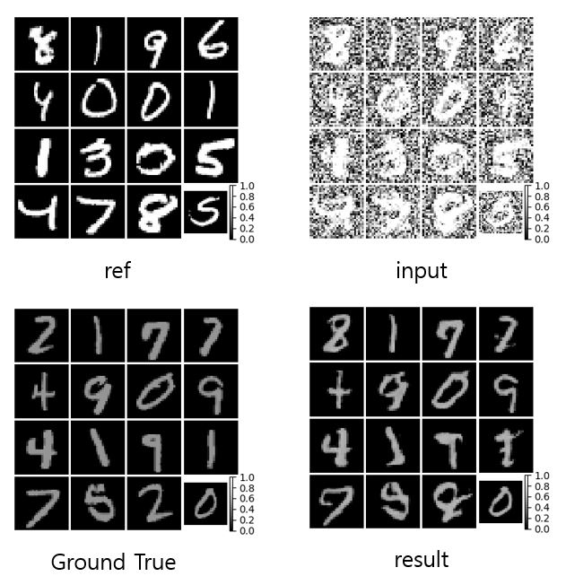

#### 3.6 resConvNet_v2_dcgans 결과

 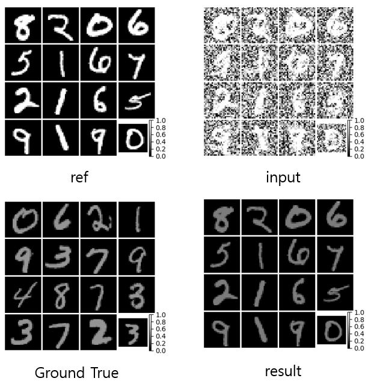

#### 3.7 resConvNet_v3_dcgans 결과

 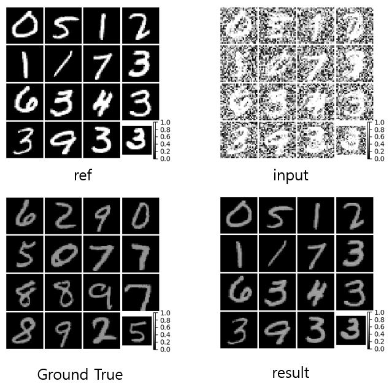

#### 3.8 resConvNet_v4_dcgans 결과

 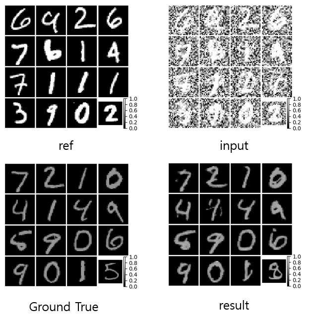

#### 3.9 resConvNet_v5_dcgans 결과

 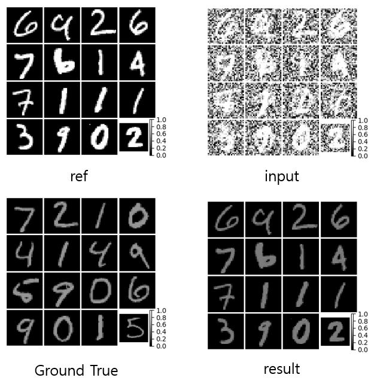

#### 3.10 resConvNet_v6_dcgans 결과

 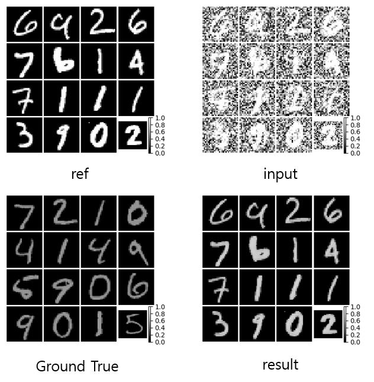

#### 3.11 resConvNet_v7_dcgans 결과

 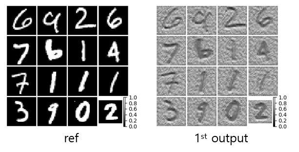

### 4. 결론
