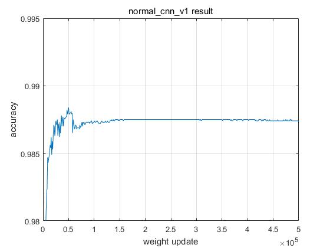
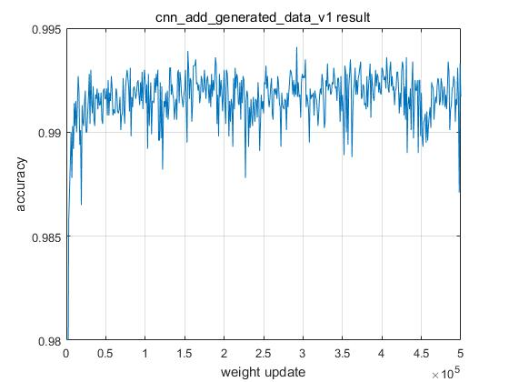

# Improve classification accuracy using generative data from GANs(ver. MNIST experiment)
#

딥러닝 분야에서일반적으로 데이터가 많으면 정확도가 올라간다고 한다. 하지만 실제 환경에 적용하려고 하면 생각보다 다양한 데이터를 많이 구할 수 없다. 부족한 데이터를 채우기 위해서 Generative Adversarial Networks(GANs)을 이용해 생성된 데이터를 이용해서 부족한 데이터 보완을 통해서 특정 모델의 정확도가 올라가는지 확인해 보는 실험을 해보았다.

MNIST 데이터(0부터 9까지 손으로 쓴 숫자)를 예로 들어 다양한 데이터를 왜 많이 구할 수 없는지 알아보자. 사람마다 각자 0부터 9까지 숫자를 쓸 때 고유의 스타일이 있다. 이 스타일은 그 사람 고유의 확률분포라고 생각하자. 만약 한 사람당 0부터 9까지 손글씨체가 하나의 데이터 셋에 포함되지 않는다면 무슨 일이 발생할까? 아마도 모든 손글씨체가 담겨 있는 데이터로 학습한 경우와 비교하면 일반적으로 더 낮은 정확도의 결과를 얻게 된다. 여기서 우리가 가지고 있는 MNIST 데이터가 모든 사람의 분포를 가지고 있다고 생각할 수 있을까? 아마도 대부분은 가지고 있을 수 도 있지만 소수 사람들의 스타일은 0부터9까지 모두 가지고 있지 않을 수 도 있다. 이 실험의 첫번째 가정은 “MNIST 데이터는 0부터 9까지 일관된 스타일 데이터로 이루어지지 않았다.” 이다.

GANs으로 생성된 데이터는 일반적으로 학습에 사용된 데이터와 같은 확률분포를 따르는 것으로 알려졌다. 이 실험에서는 Condtional GANs을 이용해서 위에서 제기한 0부터 9까지 일관된 스타일을 데이터를 만들어서, 그 데이터를 학습에 추가하면 정확도가 올라갈 것이라고 생각했다.

위의 내용을 간단히 정리해보면,
* 문제 : 딥러닝에서 정확도를 높이기 위해서는 많은 데이터가 많이 필요하다. 하지만 적은 데이터를 가지고 정확도를 향상 시키는 방법은 없을까?
* 문제 분석 :  많은 데이터의 장점 중 하나는 은 다양한 데이터 분포를 가지고 있는 점이다. 이러한 장점이 정확도를 올린다고 생각한다.
* 해결 방법 : 적은 데이터를 가지고 다양한 데이터 분포를 만들면 된다.
* 결론 : GANs으로 생성된 데이터는 학습에 사용된 데이터의 분포를 학습한다. 따라서 이 데이터를 학습에 이용하면 모델의 정확도가 향상되지 않을까?

#
### 1. basic ConvNN(normal_cnn_v1)와 Conditional GANs으로 추가한 ConvNN(cnn_add_generated_data_v1) 결과 비교
####
실험 방법은 conditional GANs(ex_basic5_v1.py)으로 미리 학습을 한 다음, basic ConvNN(normal_cnn_v1)는 오직 MNIST data set을 사용하고 Conditional GANs으로 추가한 ConvNN(cnn_add_generated_data_v1) 경우 반반 섞어서 학습을 했다.(자세한 내용은 코드 참조) 이 실험의 목적은 같은 네트워크 구조를 사용했을 경우 데이터에 따라서 성능이 어떻게 달라지는 확인하는 것이다. 따라서 네트워크 정의는 임의로 했다.
   
 
위 결과를 보면 normal ConvNN을 경우 특정값으로 수렴하는 것으로 보이지만 GANs으로 생성된 데이터와 같이 사용한 경우 정확도의 최대값은 높아 지지만 매우 불안정한 것을 볼 수 있다.
* 실험 결과 분석 : GANs으로 생성된 데이터를 이용할 경우 최대 정확도는 올라가지만 진동이 심하여 정확도가 불안정 하다.  
* 불안정한 원인 분석 : 두 네트워크의 차이점은 input data의 수라고 생각한다. normal ConvNN의 경우 input data가 60K개 이다. 하지만 GANs르 생성된 데이터는 100차원 데이터가 각각 평균 0과 분산 1로 이루어진 정규분포를 따르는 값을 입력 데이터로 한다. 따라서 생성될 수 있는 데이터의 조합은 한 차원당 약 10K의 경우의 수가 생긴다고 한다면 나올 수 있는 조합은 약 10K^100^개이다. 즉, GANs으로 생성된 데이터를 추가해서 학습하는 경우 input data의 수는 약 60K + 10K^100^개이다.
* 결론 : GANs으로 생성된 데이터의 경우의 수를 줄인다. 줄이는 방법은 각 차원의 값을 반올림 하여 사용하면 경우의 수를 줄일 수 있을 거라고 생각한다.

#
###2.     
